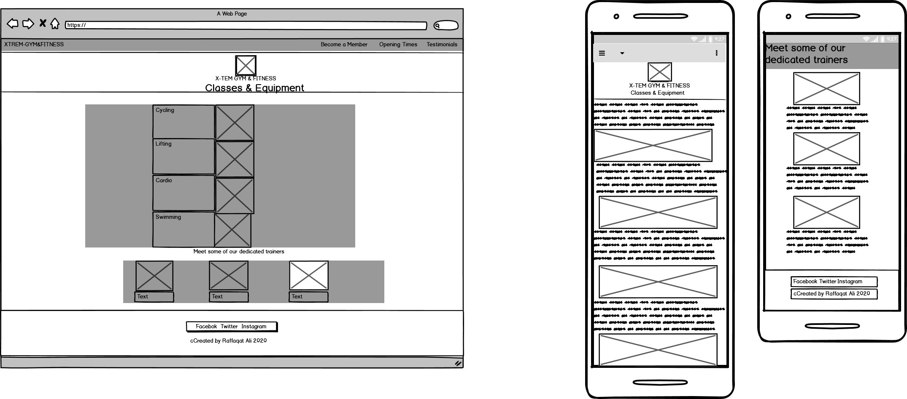
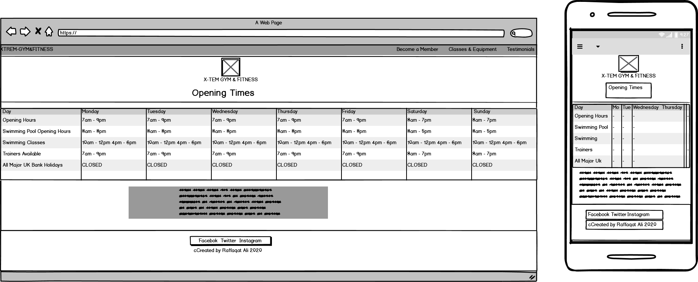
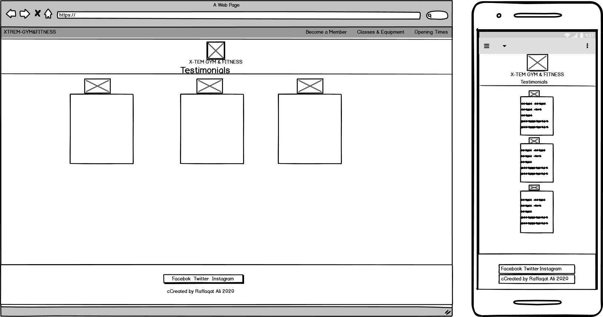

# X-TREM GYM
The purpose of my project is to design a website for a gym, to attract new members. My design is to keep it simple but stylish. I want to design it so that it attracts new members with easy and a simple layout for them to understand and find the classes tailored for them. Purpose of website 
- To make a new gym website 
- Design it for people at all ages 
- Easy to use 
- Colourful design and layout 
- To make all classes and equipment available for all people

## Contents
- [ ] UX
- [ ] New User
- [ ] Features
- [ ] Skeleton
- [ ] Layout
- [ ] Technologies Used
- [ ] Testing
- [ ] Deployment
- [ ] Credits/Media
- [ ] Acknowledment

 ### UX
 I wanted to design three pages, first being the home page and then classes and join page. But after careful consideration, I thought three pages was too short. So I decided to add a two more pages to give the website extra features and navigation etc. But I wanted to colour code with the main pages so that I make the pages stand out. 
 - Easy to navigate 
 - To help the customer understand what they are signing up for • To allow the customers to interact 
 - To be user friendly and engage 
 - To add social media links, to keep up to date on the latest news In my design I used a bootstrap type to layout the designs and it to set the website to a gym feature website. 
 #### New User 
 As a new member/customer; 
 - I wanted an easy to navigate web site 
 - Easy to understand 
 - How to join 
 - To see what is available 
 - To see the trainers 
 - To see address/ how to contact etc As an owner/manager of the gym; 
 - I wanted a new member wanting to join, to find it easy to become a member 
 - I wanted to keep it simple and not to complex 
 - I wanted to keep it up to date, with features like social media etc

### Features

I wanted to create five main pages; In my main homepage, I wanted it to have the fitness/gym designs with the colour theme being purple. As the main page has a purple colour, I wanted to reflect this with my header and footer layout. I wanted to create a website with a navigation bar as the sites main navigation to the different pages. I think having the navigation bar gives the website a more modern look. With each page I created links so that, it is easy to navigate from page to page. If a customer wanted to go back to the main page, they would need to click on the top left title of my navigation bar.

### Skeleton
The website has five pages;
•   Index Page	
•	How to join 
•	Classes     
•	Contact     
•	Testimonial 

### Layout
I wanted to make this website a specific colour which was purple. As I felt that this colour matched the main background picture that I have used for every page in project.
Having the social media links in my footer of every page. I designed each social media link with the actual background colours of the actual social medias.
I designed my pages to have a navigation bar and footer.

### Technologies Used
o	Bootstrap 
o	Font Awesome 
o	HTML Validator
o	CSS3 Validator
o	Stack overflow
o	W3schools
### Testing
I have tested my products on;
o	Google Chrome
o	Microsoft internet Explorer
o	Firefox
o	Google
o	Tested my android device

After completing my web pages, I carried testing using various search web pages to see if there were any problems. 
After designing each page, I would save it and then once the page was refreshed, I would then go into my pages and carry out the testing.
I found that there were no issues and that the pages were loading without any problems.
At times I had issues with trying to make my webpage responsive on a device. As for this I had to then use bootstrap layout designs.
As a way of testing, I referred a friend to try and navigate the website and see if they found it user friendly. After they carried out their testing, they were very happy with the layout and designs.
As my final test phase, I asked if my mentor to review my webpage and after reviewing it, they were very happy with this.

### Deployment
In my account GitHub website, I selected Repositories
I selected Xtreme-Gym from the GitHub Dashboard.
I navigated to Settings and to the GitHub Pages section.
From the Source section, I clicked on the drop-down menu and selected Master Branch.
The live link can be found under - https://raff1988.github.io/Xtreme-Gym/
Once Master Branch is selected, the page has been automatically refreshed, with a detailed ribbon display GitHub Source Saved Pages indicating the successful implementation.

### Credits/Media
All of the images that I used for my website, I used from Google images.
The icons that I used for my webpage were taken from Font Awesome.
I used https://www.freelogodesign.org/ for my logo design

### Acknowledgements
When creating my website, I first researched and looked at how other gym websites look. After having an idea of how my website should look, I had great ideas from my mentor. Using google, Bootstrap, W3 Schools and Stack overflow.

