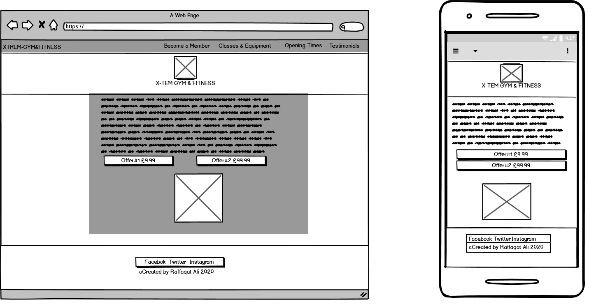
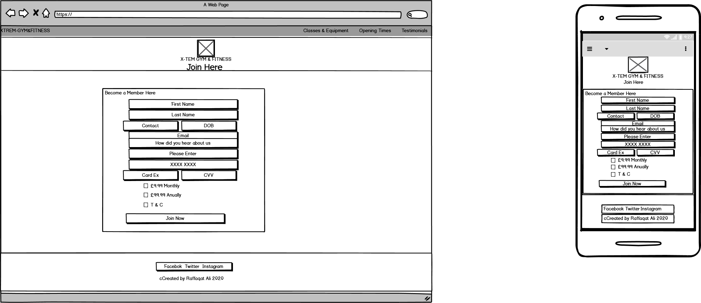

X-TREM GYM
The purpose of my project is to design a website for a gym, to attract new members. My design is to keep it simple but stylish. I want to design it so that it attracts new members with easy and a simple layout for them to understand and find the classes tailored for them.
Purpose of website
•	To make a new gym website
•	Design it for people at all ages
•	Easy to use
•	Colourful design and layout
•	To make all classes and equipment available for all people

Contents
•	UX
•	New User
•	Purpose
•	Features
•	Skeleton
•	Layout
•	Technologies Used
•	Testing
UX
I wanted to design three pages, first being the home page and then classes and join page. But after careful consideration, I thought three pages was too short. So I decided to add a two more pages to give the website extra features and navigation etc.
But I wanted to colour code with the main pages so that I make the pages stand out.
•	Easy to navigate
•	To help the customer understand what they are signing up for
•	To allow the customers to interact
•	To be user friendly and engage
•	To make it a social experience
In my design I used a bootstrap type to layout the designs and it to set the website to a gym feature website.
New User
As a new member/customer;
•	I wanted an easy to navigate web site 
•	Easy to understand
•	How to join
•	To see what is available
•	To see the trainers
•	To see address/ how to contact etc
As an owner/manager of the gym;
•	I wanted a new member wanting to join, to find it easy to become a member
•	I wanted this to be designed for all ages
•	I wanted to keep it simple and not to complex
•	I wanted to keep it up to date, with features like social media etc

Features

I wanted to create five main pages;
In my main homepage, I wanted it to have the fitness/gym designs with the colour theme being purple. As the main page has a purple colour, I wanted to reflect this with my header and footer layout.
I wanted to create a website with a navigation bar as the sites main navigation to the different pages.
I think having the navigation bar gives the website a more modern look.

Skeleton
The website has five pages;
•   Index Page	
•	How to join 
•	Classes
•	Contact
•	Testimonial

Layout
I wanted to make this website a specific colour which was purple. As I felt that this colour matched the main background picture that I have used for every page in project.
Having the social media links in my footer of every page. I designed each social media link with the actual background colours of the actual social medias.

Technologies Used
o	Bootstrap 
o	Font Awesome 
o	HTML Validator
o	CSS Validator
o	Google
o	Tested my android device
Testing
I have tested my products on;
o	Google Chrome
o	Microsoft internet Explorer
o	Firefox
After completing my web pages, I carried testing using various search web pages to see if there were any problems. 
I found that there were no issues and that the pages were loading without any problems.
In this section, you need to convince the assessor that you have conducted enough testing to legitimately believe that the site works well. Essentially, in this part you will want to go over all of your user stories from the UX section and ensure that they all work as intended, with the project providing an easy and straightforward way for the users to achieve their goals.
Whenever it is feasible, prefer to automate your tests, and if you've done so, provide a brief explanation of your approach, link to the test file(s) and explain how to run them.
For any scenarios that have not been automated, test the user stories manually and provide as much detail as is relevant. A particularly useful form for describing your testing process is via scenarios, such as:
1.	Contact form: 
i.	Go to the "Contact Us" page
ii.	Try to submit the empty form and verify that an error message about the required fields appears
iii.	Try to submit the form with an invalid email address and verify that a relevant error message appears
iv.	Try to submit the form with all inputs valid and verify that a success message appears.
In addition, you should mention in this section how your project looks and works on different browsers and screen sizes.
You should also mention in this section any interesting bugs or problems you discovered during your testing, even if you haven't addressed them yet.
If this section grows too long, you may want to split it off into a separate file and link to it from here.
Deployment
This section should describe the process you went through to deploy the project to a hosting platform (e.g. GitHub Pages or Heroku).
In particular, you should provide all details of the differences between the deployed version and the development version, if any, including:
•	Different values for environment variables (Heroku Config Vars)?
•	Different configuration files?
•	Separate git branch?
In addition, if it is not obvious, you should also describe how to run your code locally.
Credits
Content
•	The text for section Y was copied from the Wikipedia article Z
Media
•	The photos used in this site were obtained from ...
Acknowledgements
•	I received inspiration for this project from X

